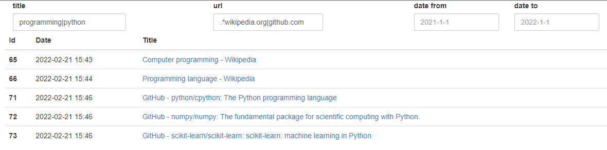

# Regex Bookmarks 

\- Regular-expression compatible bookmarks searching capability on Chrome

A Chrome/Chromium extension that provides a regular-expression compatible bookmarks searching capability

--- 

--- 

- How to install 

chrome://extensions/ > Developer mode > load unpacked

- How to use 

Enter your regex search query on the title and/or url input box so you can instantly see the result. 

Note: Since currently the project is on beta, it only supports bookmarks under the "Other bookmarks" sub folder. 

--- 

You can freely use the software for personal use only; Use the software at your own risk. 

Copyright @yuis-ice; All rights reserved
